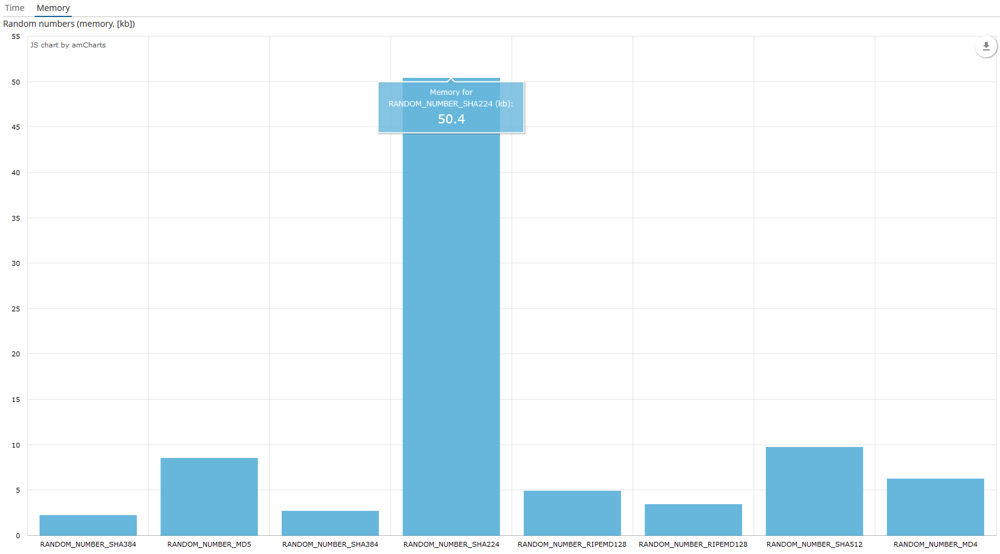

# Practice
## Анализ возможностей криптографических библиотек на языке Java
Исследуемые библиотеки:
* Bouncy Castle
* JCA (Java Cryptography Architecture)

В данной работе проверяются возможности криптографических библиотек на языке Java. Сравнение идет по двум критериям: времени выполнения и количества затрачиваемой памяти.
Проверялись следующие базовые криптографческие алгоритмы:
* Хэш-функции - функция генерации хеша запускается 16000 раз. Результат выполнения функции поступает на вход хеш функции на следующем шаге;
* Цифровые подписи - генерация цифровой подписи и ее проверка;
* Генераторы случайных чисел - генерирование случайных чисел пока для сгенерированного числа не превысит 1 мегабайт.

### Главный экран

В данном экране можно создать сущность "Algorithm".
### Экран редактирования алгоритмов

С помощью кнопки "Refresh Info" вычислить время и количество памяти, которое затрачивает компилятор при запуске выбранной функции.
### Хеш-фукции
#### Хеш-фукции (время выполнения)

#### Хеш-фукции (затрачиваемая память)

### Цифровые подписи
#### Цифровые подписи (время выполнения)

#### Цифровые подписи (затрачиваемая память)

### Генераторы случаных чисел
#### Генераторы случаных чисел (время выполнения)

#### Генераторы случаных чисел (затрачиваемая память)

### Вспомогательные ссылки
* [The Bouncy Castle FIPS Java API in 100 Examples (Final Draft)](https://www.bouncycastle.org/fips-java/BCFipsIn100.pdf)
* [Bouncy Castle git repository](https://github.com/bcgit/bc-java)
* [Bouncy Castle documentation](https://www.bouncycastle.org/documentation.html)
* [Java Cryptography Architecture](https://github.com/dsiproject/krypton)
* [Handbook Applied Cryptography](https://doc.lagout.org/network/3_Cryptography/CRC%20Press%20-%20Handbook%20of%20applied%20Cryptography.pdf)
