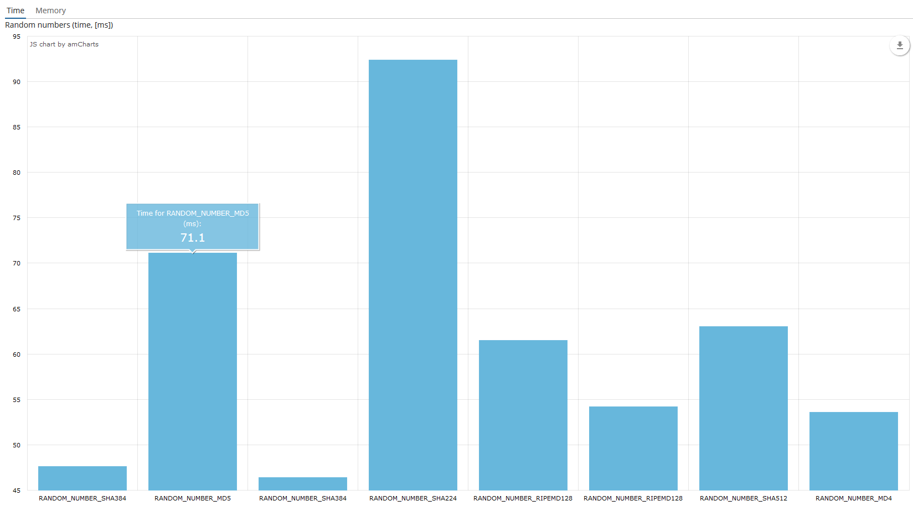

# Practice
## Анализ возможностей криптографических библиотек на языке Java
Исследуемые библиотеки:
* Bouncy Castle
* JCA (Java Cryptography Architecture)

В данной работе проверяются возможности криптографических библиотек на языке Java. Сравнение идет по двум критериям: времени выполнения и количества затрачиваемой памяти.
Проверялись следующие базовые криптографческие алгоритмы:
* Хэш-функции - функция генерации хеша запускается 16000 раз. Результат выполнения функции поступает на вход хеш функции на следующем шаге;
* Цифровые подписи - генерация цифровой подписи и ее проверка;
* Генераторы случайных чисел - генерирование случайных чисел пока для сгенерированного числа не превысит 1 мегабайт.

## Измерение параметров для сравнения алгоритмов
Операции измерения времени и объема затрачиваемой памяти выполняются 10 раз для получения усредненного результата.
Данный процесс происходит в функции [ProcessServiceBean#runAlgorithm](modules/core/src/com/company/practice/service/ProcessServiceBean.java)
```
for (int i = 0; i < NUMBER_OF_OPERATIONS; i++) {
    long[] results = run(algorithm);
    times[i] = results[0];
    memories[i] = results[1];
}
double time = Arrays.stream(times).average().orElse(Double.NaN);
double memory = Arrays.stream(memories).average().orElse(Double.NaN);
algorithm.setTime(time);
algorithm.setMemory(memory);
```

### Измерение времени выполнения алгоритма
Измерение времени выполнения алгоритма происходит в классе [ProcessServiceBean](modules/core/src/com/company/practice/service/ProcessServiceBean.java).
```
long start = System.currentTimeMillis(); // текущее время в миллисекундах до запуска алгоритма
/*
Выполнение алгоритма
*/
long finish = System.currentTimeMillis(); // текущее время в миллисекундах после запуска алгоритма
algorithm.setTime(finish - start); // разница времени после и до выполнения алгоритма и есть общее время выполнения алгоритма
```

### Измерение объема затрачиваемой алгоритмом памяти
Измерение объема затрачиваемой алгоритмом памяти происходит в классе [ProcessServiceBean](modules/core/src/com/company/practice/service/ProcessServiceBean.java). Используется вызов системной функции `Runtime.getRuntime().freeMemory()`, которая возвращает количество памяти в байтах доступное приложению на данный момент.То есть это пространство выделено под программу, но еще не задействовано никаким либо процессом.
```
long memoryStart = Runtime.getRuntime().freeMemory(); // количество свободной памяти до выполнения алгоритма
/*
Выполнение алгоритма
*/
long memoryFinish = runAlgorithm(algorithm); // количество свободной памяти после выполнения алгоритма
algorithm.setMemory(Math.abs((double) ((memoryStart - memoryFinish) / 1024)));// объем затрачиваемой памяти в килоБайтах
``` 
Количество свободной памяти, которое измеряется после выполнения алгоритма внутри функции выполнения, когда garbage collector еще не успел очистить ресурсы, которые были затрачены на выполнение функции.

### Главный экран


В данном экране можно создать сущность "Algorithm".
### Экран редактирования алгоритмов


С помощью кнопки "Refresh Info" вычислить время и количество памяти, которое затрачивает компилятор при запуске выбранной функции.
### Хеш-фукции
#### Хеш-фукции (время выполнения, миллисекунды)

#### Хеш-фукции (затрачиваемая память, кБайт)


Рассмотренные хеш-функции:
* Gost R 34.11-94
* MD2
* MD4
* MD5
* SHA-1
* SHA-224
* SHA-256
* SHA-384
* SHA-512
* Tiger
* RIPEMD128
* RIPEMD160
* RIPEMD256
* RIPEMD320
* WhirlpoolDigest
### Цифровые подписи
#### Цифровые подписи (время выполнения, миллисекунды)

#### Цифровые подписи (затрачиваемая память, кБайт)

Рассмотренные алгоритмы цифровой подписи:
* DSA
* RSA
* ECDSA

### Генераторы случаных чисел
#### Генераторы случаных чисел (время выполнения, миллисекунды)

#### Генераторы случаных чисел (затрачиваемая память, кБайт)

Генераторы случайных чисел на дайджестах со счетчиком:
* Random generation based on Gost R 34.11-94
* Random generation based on MD2
* Random generation based on MD4
* Random generation based on MD5
* Random generation based on SHA-1
* Random generation based on SHA-224
* Random generation based on SHA-256
* Random generation based on SHA-384
* Random generation based on SHA-512
* Random generation based on Tiger
* Random generation based on RIPEMD128
* Random generation based on RIPEMD160
* Random generation based on RIPEMD256
* Random generation based on RIPEMD320
* Random generation based on WhirlpoolDigest

### Вспомогательные ссылки
* [The Bouncy Castle FIPS Java API in 100 Examples (Final Draft)](https://www.bouncycastle.org/fips-java/BCFipsIn100.pdf)
* [Bouncy Castle git repository](https://github.com/bcgit/bc-java)
* [Bouncy Castle documentation](https://www.bouncycastle.org/documentation.html)
* [Java Cryptography Architecture](https://github.com/dsiproject/krypton)
* [Handbook Applied Cryptography](https://doc.lagout.org/network/3_Cryptography/CRC%20Press%20-%20Handbook%20of%20applied%20Cryptography.pdf)
